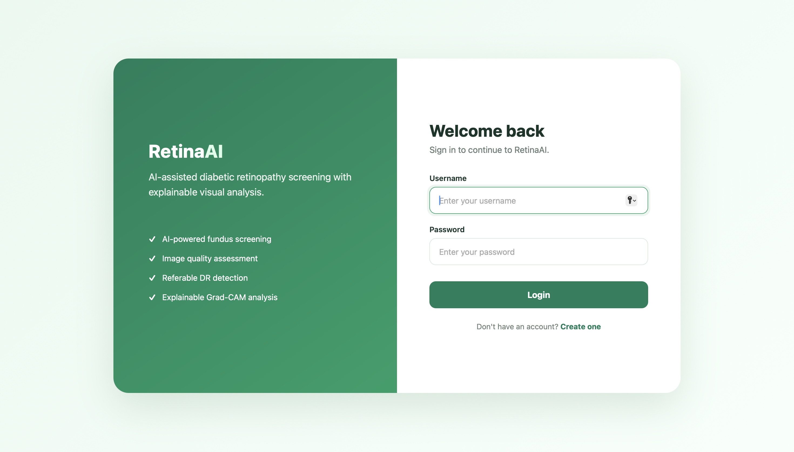
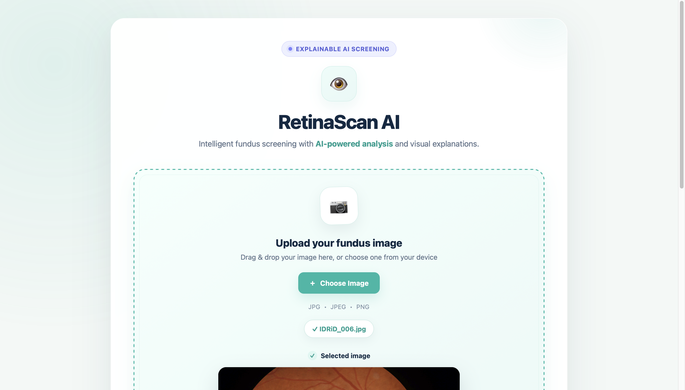
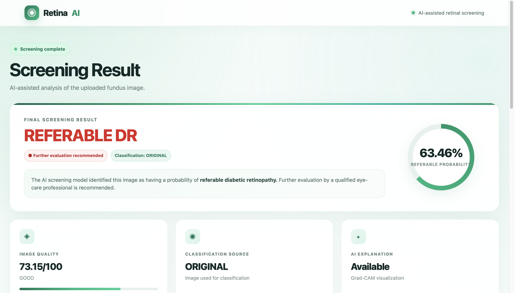
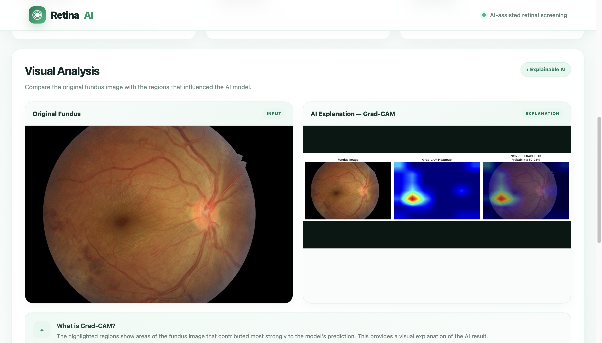
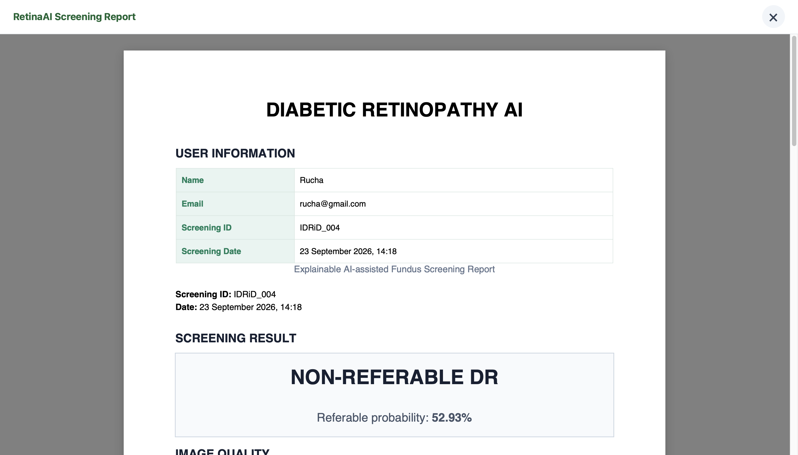

RetinaAI 🩺

Explainable AI for Diabetic Retinopathy Screening

RetinaAI is an AI-assisted web application designed to screen retinal fundus images for referable diabetic retinopathy (DR).

The system combines retinal image-quality assessment, image enhancement, deep-learning classification, Grad-CAM explainability, user authentication, and automated screening-report generation into a single web application.

Medical disclaimer: RetinaAI is an educational and research prototype. It is not intended to replace examination, diagnosis, or treatment by a qualified eye-care professional.

✨ Features

🔐 User registration and login

🖼️ Retinal fundus image upload

🔍 Automated retinal image-quality assessment

✨ Enhancement of borderline-quality images

🤖 EfficientNet-B0 based referable DR classification

📊 Referable DR probability

🎯 Threshold-based screening decision

🔥 Grad-CAM explainability

📄 Automated PDF screening reports

👤 User information in generated reports

📋 Database-backed screening records

🎨 Medical-themed web interface

❌ In-page screening-report viewer with close button

⚕️ Clinical-use disclaimer

🧠 How RetinaAI Works

                 Retinal Fundus Image
                         │
                         ▼
                Image Quality Check
                         │
              ┌──────────┴──────────┐
              │                     │
          Good Quality          Borderline
              │                     │
              │              Image Enhancement
              │                     │
              └──────────┬──────────┘
                         ▼
                  Quality Re-check
                         │
                         ▼
                EfficientNet-B0
                         │
                         ▼
             Referable DR Probability
                         │
                         ▼
                Threshold Decision
                         │
              ┌──────────┴──────────┐
              │                     │
       Non-Referable             Referable
              │                     │
              └──────────┬──────────┘
                         ▼
                    Grad-CAM
                         │
                         ▼
                Screening Report

🔬 Screening Approach

The project formulates diabetic retinopathy screening as a binary classification problem.

DR Grade

Screening Category

Grade 0

Non-referable

Grade 1

Non-referable

Grade 2

Referable

Grade 3

Referable

Grade 4

Referable

Grade 0–1 → Non-referable
Grade 2–4 → Referable

The current screening threshold used by the application is:

0.55

🔍 Image Quality Assessment

RetinaAI evaluates the quality of an uploaded retinal image before classification.

The quality pipeline considers:

Focus

Brightness

Contrast

Field of view

Images are categorized as:

GOOD
BORDERLINE
UNGRADEABLE

For borderline images, the system can apply image enhancement and perform quality assessment again.

Images considered ungradable are not directly passed to the classification stage.

🤖 AI Model

RetinaAI uses an EfficientNet-B0 based deep-learning classifier for referable diabetic retinopathy screening.

The primary trained model used by the current application is:

models/dr_referable_best.pth

The project uses the IDRiD (Indian Diabetic Retinopathy Image Dataset) and a binary referable/non-referable screening formulation.

📊 Model Evaluation

Evaluation was performed on the official IDRiD test set kept separate from model training.

At the selected threshold of 0.55, the development evaluation produced:

Metric

Value

Accuracy

80.58%

Sensitivity

81.25%

Specificity

79.49%

ROC-AUC

87.50%

False Positives

8

False Negatives

12

These values represent the project's development evaluation and should not be interpreted as clinical validation.

🔥 Explainable AI with Grad-CAM

RetinaAI uses Grad-CAM to provide visual context for the model's prediction.

Retinal Image
      ↓
AI Prediction
      ↓
Grad-CAM
      ↓
Activation Heatmap
      ↓
Visual Explanation

The explanation provides additional visual context and is not a clinical diagnostic tool.

# 🖥️ Application Screenshots

The following screenshots show the main RetinaAI application workflow.

All screenshots are stored in:

```text
docs/screenshots/
```

### 🔐 Login



### 🖼️ Retinal Image Upload



### 📊 Screening Result



### 🔥 Grad-CAM Explainability



### 📄 Screening Report


## 🏗️ Project Structure

```text
Diabetic_Retinopathy/
│
├── web/
│   ├── manage.py
│   ├── dr_web/
│   │   ├── settings.py
│   │   ├── urls.py
│   │   └── wsgi.py
│   │
│   └── screening/
│       ├── migrations/
│       ├── templates/
│       │   ├── registration/
│       │   │   ├── login.html
│       │   │   └── signup.html
│       │   └── screening/
│       │       ├── upload.html
│       │       └── result.html
│       ├── auth_views.py
│       ├── forms.py
│       ├── models.py
│       ├── urls.py
│       └── views.py
│
├── src/
│   ├── classification/
│   ├── inference/
│   │   ├── predict.py
│   │   └── report_generator.py
│   └── quality/
│
├── models/
│   └── dr_referable_best.pth
│
├── docs/
│   └── screenshots/
│       ├── gradcam.png
│       ├── login.png
│       ├── report.png
│       ├── result.png
│       └── upload.png
│
├── requirements.txt
├── .gitignore
└── README.md
```

🛠️ Technology Stack

Frontend

HTML5

CSS3

JavaScript

Backend

Python

Django

Machine Learning

PyTorch

Torchvision

EfficientNet-B0

OpenCV

NumPy

Pandas

Scikit-learn

SciPy

Explainability

Grad-CAM

Report Generation

ReportLab

Database

SQLite for local development

⚙️ Local Installation

1. Clone the repository

git clone https://github.com/ruchaakadam/Diabetic_Retinopathy.git
cd Diabetic_Retinopathy

2. Create a virtual environment

macOS/Linux:

python3 -m venv venv
source venv/bin/activate

Windows:

python -m venv venv
venv\Scripts\activate

3. Install dependencies

pip install -r requirements.txt

4. Run database migrations

python web/manage.py migrate

5. Start the application

python web/manage.py runserver

Open:

http://127.0.0.1:8000

🔑 Application Flow

Open RetinaAI
      ↓
Create Account
      ↓
Login
      ↓
Upload Fundus Image
      ↓
Image Quality Assessment
      ↓
Enhancement if Required
      ↓
AI Screening
      ↓
Referable Probability
      ↓
Screening Decision
      ↓
Grad-CAM Explanation
      ↓
Generate Screening Report

📁 Important Files

src/inference/predict.py

Main AI inference pipeline responsible for image loading, quality assessment, enhancement, model inference, threshold-based decision, Grad-CAM generation, and report generation.

src/inference/report_generator.py

Responsible for generating the PDF screening report.

src/quality/

Contains retinal image-quality assessment functionality.

web/screening/views.py

Connects the Django web application with the AI inference pipeline.

web/screening/models.py

Stores screening information associated with authenticated users.

web/screening/result.html

Displays screening results and provides the in-page screening-report viewer.

🎯 Project Goals

RetinaAI demonstrates how multiple technologies can be combined into an AI-assisted screening platform:

Computer vision

Deep learning

Explainable AI

Web development

User authentication

Image-quality assessment

Automated PDF reporting

Database-backed screening records

🔮 Future Improvements

Larger and more diverse retinal datasets

External validation on additional datasets

Improved image-quality assessment

Improved model calibration

Secure cloud-based image storage

Production-grade database infrastructure

Role-based access for healthcare professionals

Detailed screening-history dashboards

Mobile-friendly deployment

Additional retinal disease screening capabilities

⚕️ Medical Disclaimer

RetinaAI is an educational and research prototype.

The predictions generated by this application are not a medical diagnosis and should not be used as a substitute for examination, diagnosis, or treatment by a qualified ophthalmologist or other eye-care professional.

Users should seek appropriate professional medical advice for clinical decisions.

👩‍💻 Project

RetinaAI — Explainable AI for Diabetic Retinopathy Screening

Developed as a student AI, machine-learning, and web-development project.

📜 License

This project is intended for educational and research purposes.

Please review the licensing terms of the IDRiD dataset and other third-party resources before redistributing them.